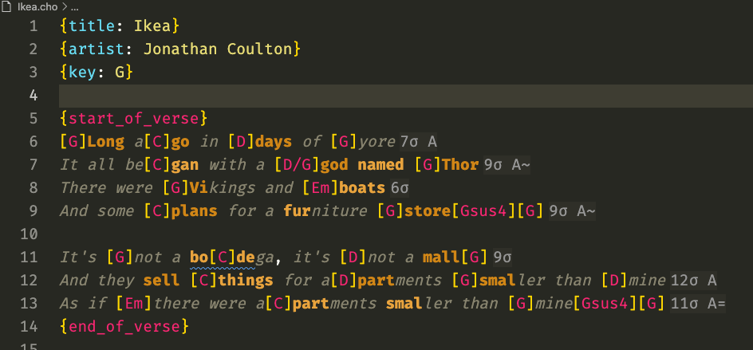

# melic-lsp

A [Chordpro](http://chordpro.org/) language server, designed for songwriting.




This wraps [`quadrismegistus/prosodic`](https://github.com/quadrismegistus/prosodic)
and displays its information via LSP.

## Features

|                    |                                                                |
| ------------------ | -------------------------------------------------------------- |
| **Highlighting**   | Syllables coloured by lexical stress                           |
| **Line signature** | Syllable count at the end of each line                         |
| **Rhyme**          | Line endings labelled with rhyme, with slant rhyme support     |
| **Hover**          | Docs and detailed analysis available on hover                  |
| **Diagnostics**    | ChordPro syntax, chord placement                               |
| **Outline**        | Sections and their stanzas, each with its syllable profile     |
| **Analysis**       | tools for chord/syllable/stress grid and cross-work comparison |

## Line hints

By default, Each line is annotated with its syllable count and rhyme scheme
```
Swing [D]low, sweet [G]chari[D]ot,       6σ A
Comin' for to carry me [A7]home.         8σ B
Swing [D]low, sweet [G]chari[D]ot,       6σ A=
Comin' for to [A7]carry me [D]home.      8σ B=
```

`~` marks a slant rhyme and `=` a same-word rhyme.

## The stress pattern

`melic.lineSignature.mode` will put the stress marks in the margin too:

```
Swing [D]low, sweet [G]chari[D]ot,       6σ · + [D]++ [G]+- [D]-
Comin' for to carry me [A7]home.         8σ · +---+-- [A7]+
```

`+` primary stress · `^` secondary · `-` unstressed. 

## The outline

Sections hold stanzas, and a stanza is what a rhyme scheme is measured over — a scheme
run across four quatrains at once is just noise. A verse of several stanzas says so and
gives each its own profile:

```
Verse 1                                 4 stanzas
  Stanza 1                              7,8,7,6σ · AXAX
    Countless winter nights ago,             7σ A
    A woman shivered in the cold.            8σ
    Cursed the skies, and wondered why       7σ A~
    The gods invented pain.                  6σ
```

A verse that *is* one stanza wears the profile itself, with no middle level to open.

Sections come from `{start_of_verse}` and friends — any name works, so
`{start_of_intro}` is a section too — or, failing a directive, from stanzas separated by
blank lines. Inside an environment a blank line starts a new stanza rather than ending
the section, since the directive already said where the section ends.

## Manual Annotations.

Melic takes your chordpro annotations into account when syllabalizing words.
Melic will prefer *cha·ri·ot* over *cha·riot* when the word is labelled `chari[D]ot`.
You can also apply manual overrides for specific words

```
{x_melic_word: chariot = +cha -ri -ot}      the whole document
{x_melic_word_section: fire = +fire}        the enclosing section
{x_melic_word_line: fire = +fi -re}         the next lyric line
```

### espeak

`prosodic` supports using [espeak](https://github.com/espeak-ng/espeak-ng) to infer pronunciation of words not in its dictionary.
This extension does not bundle espeak, but it will be used if it is available in the extension's environment.

Espeak is generally available in your package manager
```bash
brew install espeak-ng
sudo apt install espeak-ng
choco install espeak-ng
```

### espeak

`prosodic` also supports using [pytorch](https://github.com/pytorch/pytorch) to speed up automated scansion
This extension does not bundle pytorch, but it will be used if it is available in the extension's environment.

```bash
uv tool install torch --torch-backend=auto
```

## Development
We welcome contributions! We currently only ship an extension for VSCode:

```bash
uv sync
cd editors/vscode && npm install && cd -
brew install espeak      # optional; see below
```

Then F5 in `editors/vscode` to open an Extension Development Host.

A vim binding might be a good first contribution 👀

We have a basic test suite, and a bit of custom tooling for types
```bash
uv run pytest                      # ~124 tests, ~2s
./scripts/check_types.sh           # src/ clean, and wrong-space calls rejected
./scripts/check_versions.sh        # pyproject and package.json agree
uv run python scripts/bench_tier1.py   # gates the caching decision
uv run python scripts/smoke_lsp.py     # real LSP handshake against the real server
```

To reload during development, run

```bash
uv tool install . --force --reinstall
```
